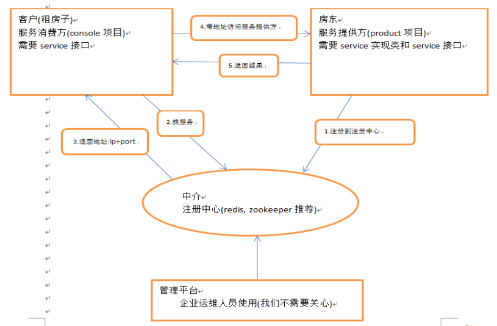
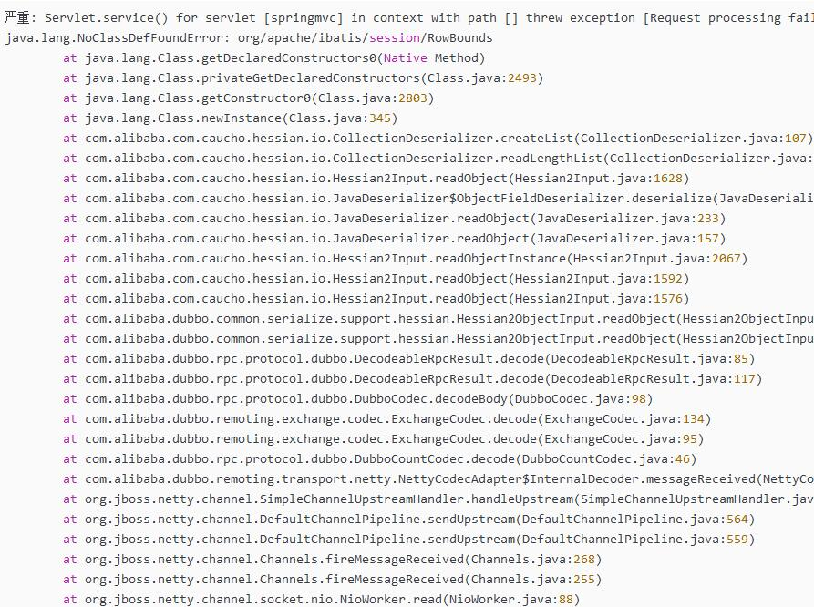
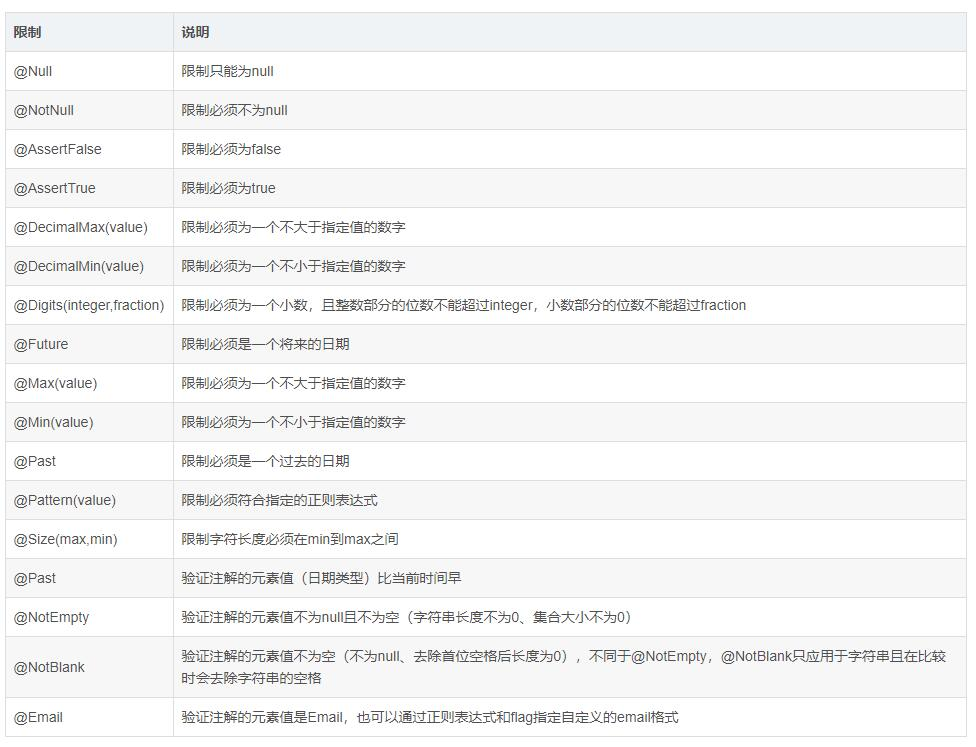

## zookeeper



图片alt就是显示在图片下面的文字，相当于对图片内容的解释。
图片title是图片的标题，当鼠标移到图片上时显示的内容。title可加可不加

#### 安装步骤

1.安装jdk

2.上传代码到linux系统中，需创建一个data文件夹目录，为注册服务使用

3.解压缩包
```
tar -zxvf *.tar.gz
<!-- 创建data -->
mkdir data
```
4.修改config
```
cd conf
mv zoo_sample.cfg  zoo.cfg
dataDir=/root/zookeeper-3.4.6/data

```
#### 命令
```
./zkServer.sh start
./zkServer.sh stop
./zkServer.sh status
```
---

## 品优购(pinyougou)

### 创建工程
1.parent。引入maven(pom)

2.pojo(.jar)

	需要实现Serializable。因为要在网络中传输

3.dao(.jar)

	引入跟数据库相关jar包
	引入pojo(依赖)

4.common(.jar)

5.sellergoods-interface(.jar)

6.sellergoods-service(.war)

	在web.xml中引入spring配置文件。
	在pom中增加interface.jar。加入interface.jar之后会依赖传递进来pojo
	使用@Autowride自动注入dao方法，dao是在本地运行所以可以实现自动装配功能。进行调用
	在spring配置文件中增加dubbo提供者
	在dubbo中的端口号.可能会有多个service 使用端口号区分开
	<dubbo:protocol name="dubbo" port="20881" />
	<dubbo:application name="pinyougou-sellergoods-service"/>  
	<dubbo:registry address="zookeeper://192.168.3.101:2181"/>
	<dubbo:annotation package="com.pinyougou.sellergoods.service.impl" /> 

7.shop-web(.war)

8.manager-web(.war)
	
	@Reference可以自动装配提供者的service

	在调用service中返回Page对象，调用之后报以下错误



	总结就是这个错误：java.lang.NoClassDefFoundError: org/apache/ibatis/session/RowBounds
	这是因为web工程中没有依赖MyBatis的包，在pom.xml中再次添加上相应的依赖就行。
	<dependency>
	    <groupId>com.github.pagehelper</groupId>
	    <artifactId>pagehelper</artifactId>	   
	</dependency>
	<dependency>
		<groupId>com.github.miemiedev</groupId>
		<artifactId>mybatis-paginator</artifactId>		
	</dependency>

---

# 注解功能(@)
	
**@Param**(mybatis)

```
<!-- @Param是MyBatis所提供的(org.apache.ibatis.annotations.Param)，作为Dao层的注解，作用是用于传递参数，从而可以与SQL中的的字段名相对应，一般在2=<参数数<=5时使用最佳。 -->
public List<Role> findRoleByMix(@Param("roleP") RoleParam role, @Param("permissionP") PermissionParam permission);
<!-- 这样就可以进行如下映射 -->
<select id="findRoleByMix" resultType="role">
    SELECT id,name FROM t_role
    WHERE roleName=#{roleP.roleName}
    AND note=#{rolep.note}
    AND level=#{permissionP.level}
<select>
```

**@RequestParam**(spring-boot,spring-mvc)

```java
@RequestMapping("/list")
public String test(int userId) {
  return "list";
} 
@RequestMapping("/list")
public String test(@RequestParam int userId) {
  return "list";
}
/*
第一种写法参数为非必传，第二种写法参数为必传。参数名为userId。
第二种写法可以通过@RequestParam(required = false)设置为非必传。因为required值默认是true，所以默认必传。
第二种写法可以通过@RequestParam("userId")或者@RequestParam(value = "userId")指定参数名。
第二种写法可以通过@RequestParam(defaultValue = "0")指定参数默认值
*/

@RequestMapping("/list")
public String test(@RequestParam(value = "userId", defaultValue = "0", required = false) int userId) {
  return "list";
}
```

**PathVariable**

```java
/*获取的是请求路径中参数的值*/
@RequestMapping("/pets/{petId}")
public void findPet(@PathVariable String petId) {
	/*todo*/
}
```

**@Valid**

```java
/*用于验证注解是否符合要求，直接加在变量user之前，在变量中添加验证信息的要求，当不符合要求时就会在方法中返回message的错误提示信息。*/
@RestController
@RequestMapping("/user")
public class UserController {
  @PostMapping
  public User create (@Valid @RequestBody User user) {
     
  }
}
public class User {
  private String id;

  @NotBlank(message = "密码不能为空")
  private String password;
}
```

