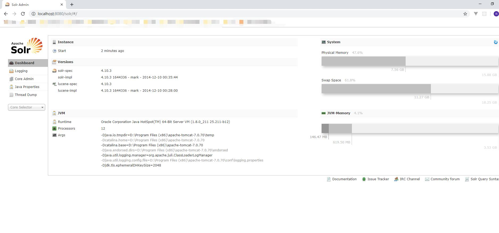

# solr
solr是开源搜索服务器，它使用REST和httpApi。它建立在lucenne(全文搜索引擎)之上。实现搜索功能

## 安装(windows)
 1. 安装Tomcat,解压即可。

 2. 解压solr

 3. 把solr的dist目录部署到tomcat中即可
 
 4. 启动tomcat
 
 5. 把solr下example/lib/ext目录下的所有jar添加到solr的工程中(\WEB-INF\lib)目录下
 
 6. 创建solrhome。solr下的example/solr目录就是一个solrhome.复制此目录到d盘改为为solrhome
 
 7. 关联solr及solrhome。需要修改solr工程的web.xml文件(D:\Program Files (x86)\apache-tomcat-7.0.70\webapps\solr\WEB-INF)
 ```
    <env-entry>
       <env-entry-name>solr/home</env-entry-name>
       <env-entry-value>/put/your/solr/home/here</env-entry-value> //E:\solrhome
       <env-entry-type>java.lang.String</env-entry-type>
    </env-entry>
 ```
 8. 启动tomcat
 
 
## 中文分析器(IK)
 1. 先导入jar包(IKAnalyzer2012FF_u1.jar)
 2. 引入3个配置文件。在WEB-INF下新建一个classes文件夹，把配置文件全部放入
 3. 修改solrhome中的E:\solrhome\collection1\conf\schema.xml
 
 4. 添加配置
  ```
    name是自定义的名字
    <fieldType name="text_ik" class="solr.TextField">
      <analyzer class="org.wltea.analyzer.lucene.IKAnalyzer" />
    </fieldType>
  ```
## 域
 stored 是否进行存储