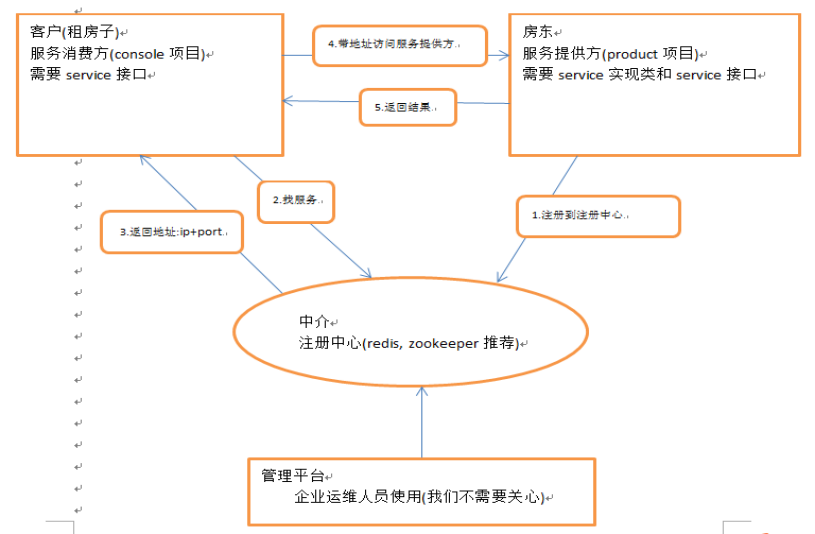

## zookeeper



图片alt就是显示在图片下面的文字，相当于对图片内容的解释。
图片title是图片的标题，当鼠标移到图片上时显示的内容。title可加可不加

#### 安装步骤

1.安装jdk

2.上传代码到linux系统中，需创建一个data文件夹目录，为注册服务使用

3.解压缩包
```
tar -zxvf *.tar.gz
<!-- 创建data -->
mkdir data
```
4.修改config
```
cd conf
mv zoo_sample.cfg  zoo.cfg
dataDir=/root/zookeeper-3.4.6/data

```
#### 命令
```
./zkServer.sh start
./zkServer.sh stop
./zkServer.sh status
```
